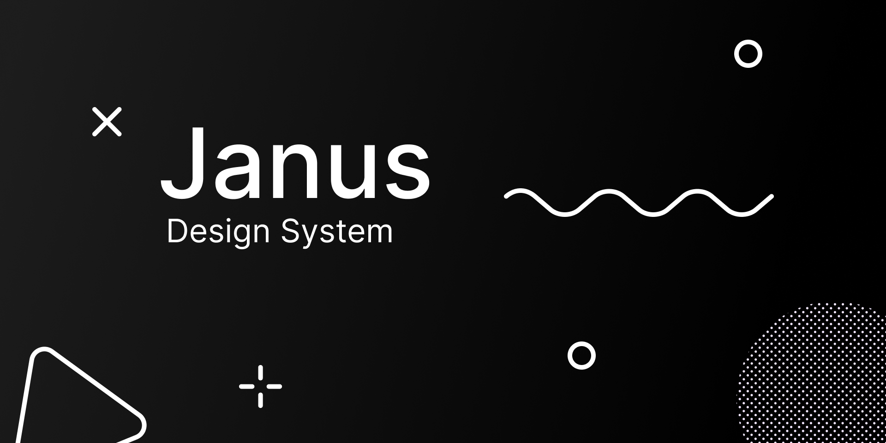

# Janus: Janus Design System v0.01



## Components for Janus React apps

### Table of Contents

- [Install & integration](#install-and-integration)
- [Run storybook in dev](#run-storybook-in-dev)
- [Methodologies](#methodologies)
  - [Atomic Design](#atomic-design)
  - [Molecules definition](#molecules-definition)
  - [Organism definition](#organism-definition)
- [Components Library Creation Guide](#components-library-creation-guide)

## Install and integration

1. Install: `npm i janus-ds --save`
2. Import styles in your index.js: `import 'janus-ds/dist/index.css'`
3. Add provider before router:
	```
	import { DesignSystemProvider } from 'janus-ds'
	const App = () =>
		<DesignSystemProvider>
	    <Router>
	    ...
	    </Router>
	  </DesignSystemProvider>
	export default App
	```
4. Import components!
	```
	import { Button } from '@ripio/janus-ds'
	const MyComp = () =>
		<Button id="my_id">
	    My button!
	  </Button>
	export default MyComp
	```

## Run storybook in dev

Follow these steps to `start the project` in development

1. Clone repository. `git clone git@github.com:juandinella/janus-ds.git`
2. Install dependencies in the project folder. `npm install`.
3. If there's some problems with dependencis, run `npx sb update`
3. Run Storybook `npm run start`, this command run Storybook and build tokens. This comman run 2 task `npm run tokens` and ` npm run storybook`

Check the `package.json` file, there you will find the commands necessary for the development

## Run test

1. Run `npm run test`

---

## Methodologies

### Atomic Design

For this project will be using the methodology to create componentes called [Atomic Design](https://shop.bradfrost.com/products/atomic-design-ebook). The component library will be creating just **Atoms** and **Molecules** with the following definitions:

#### Atoms definition

For this project an atom will be a component that is composed by an unique Atom with or without HTML tags, or just HTML tags.

#### Molecules definition

For this project a molecule is a component that is composed by at least 2 different atoms or stateful componentes

#### Organism definition

For this project organisms are assemblies of molecules functioning together as a unit
---

## Components Library Creation Guide

### Styling

We use [Styled Components]( https://styled-components.com/)


### Creating a component

We have a CLI tool to create automatically a component. Run `npm run cc` (cc stands for create component)
